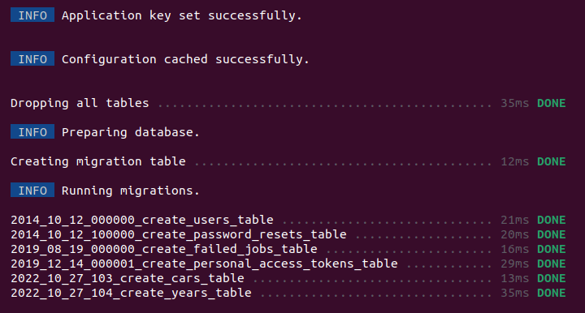
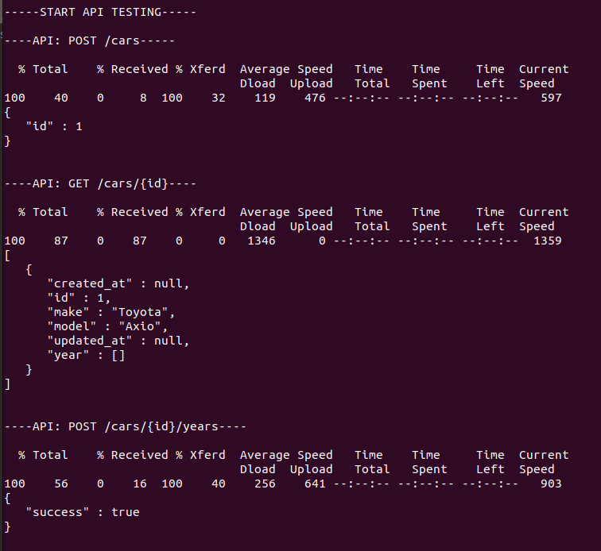
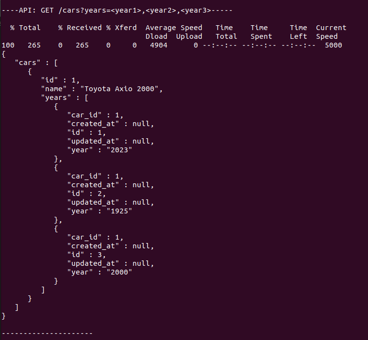
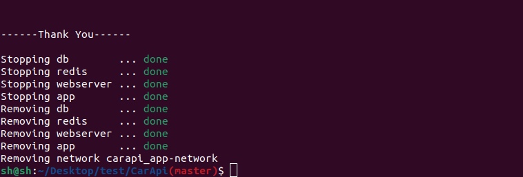

<h1 align="center">CarApi</h1>

## Tools and Technology

To run this project it is ashume that Docker and Docker Compose are already installed in the machine :

- Php Laravel
- Mysql
- Ngnix
- Redis

## Installation and Run

Copy the git ripo

```sh
git clone https://github.com/shadiqurrahaman/CarApi.git

```
Navigate to Folder

```sh
cd CarApi
```
Give Permission

```sh
sudo chmod +x ./test.sh
```
Finaly run the bash file

```sh
sudo ./test.sh

```

## Sample output




